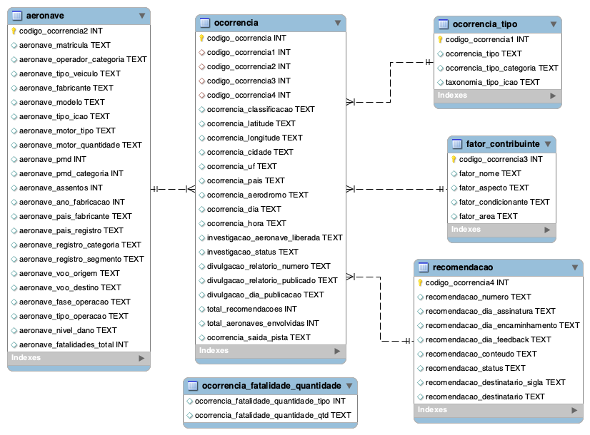

# CENIPA - Ocorrências Aeronáuticas na Aviação Civil Brasileira

- OCORRÊNCIA.csv - Informações sobre as ocorrências.
- OCORRÊNCIA_TIPO.csv - Informações sobre o tipo de ocorrência.
- AERONAVE.csv - Informações sobre as aeronaves envolvidas nas ocorrências.
- FATOR_CONTRIBUINTE.csv - Informações sobre os fatores contribuinte das ocorrências que tiveram investigações finalizadas.
- RECOMENDAÇÃO.csv - Informações sobre as recomendações de segurança geradas nas ocorrências.



### Setando imagem mysql para uso:

```docker run -p 3306:3306 --name=mysql -d mysql/mysql-server:8.0.21
docker logs mysql 2>&1 | grep GENERATED
docker exec -it mysql mysql -uroot -p
ALTER USER 'root'@'localhost' IDENTIFIED BY 'mysql';
update mysql.user set host = '%' where user='root';
docker restart mysql

docker exec -it mysql /bin/bash
SHOW VARIABLES LIKE 'secure_file_priv';
docker run --name mysql -e MYSQL_ROOT_PASSWORD=mysql -d mysql:tag --secure-file-priv=""